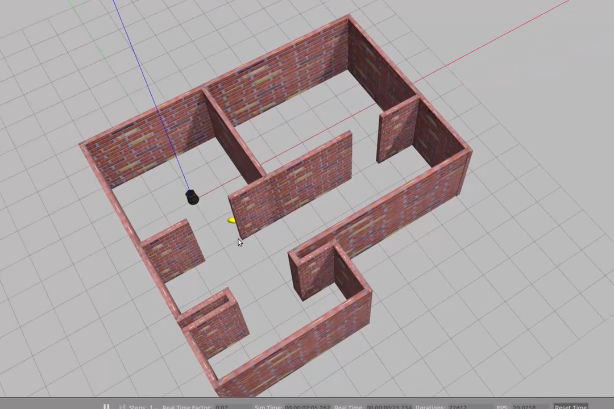
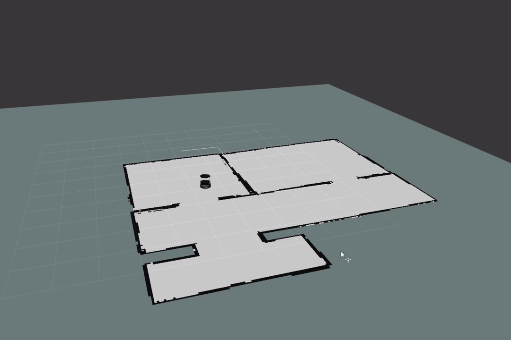
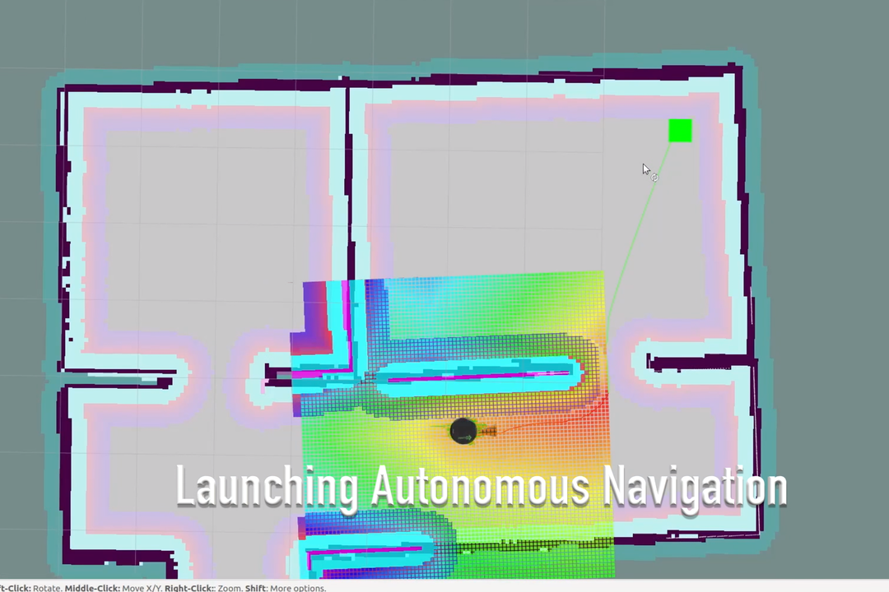

# Navigation Project Home Service Robot
This project simulates a home service robot picking up an object at a pickup location and dropping it off back at it's starting location.

#### Project Video
https://youtu.be/ES9FmUxZa_A

#### Main work
- Build Gazebo world
- Deploy turtlebot
- Build environment map using SLAM gmapping
- Integrating ROS node publishing pickup and dropoff locations with navigation
- Integrating ROS node publishing interactive "package" markers in Gazebo
- Launching project through shell scripts

#### Instructions to launch
- Requires ROS installation
- Create catkin_ws and clone /src folder contents into /src directory of workspace
- Build cakin_ws
- Source ROS environment
- Launch home_service.sh from /shellScripts directory
- Robot navigation executes automatically

#### Optional instructions
- Create the room map from scratch before launching navigation
- Launch test_slam.sh
- Build map by controlling robot with keyboard_teleop terminal
- Additionally launch save_map.sh script after building complete map
- In /src/world/ rename newMap.yaml and newMap.pgm to "MyFlat", replace existing files in world/MyFlat folder
- Edit myFlat.yaml file: replace pgm directory with name of pgm file only (no directory needed)
- Follow instructions to launch section

## Results
#### Overview:

#### Built 2D Map:

#### Localization and Navigation:

